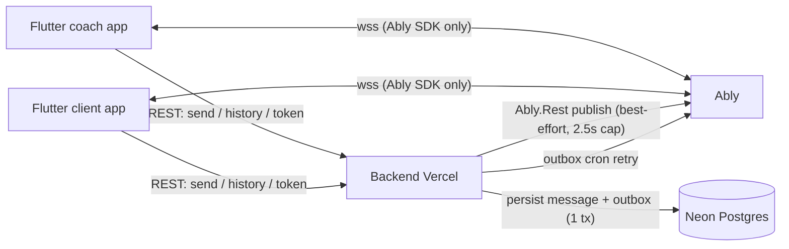
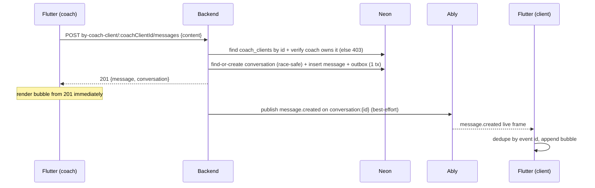
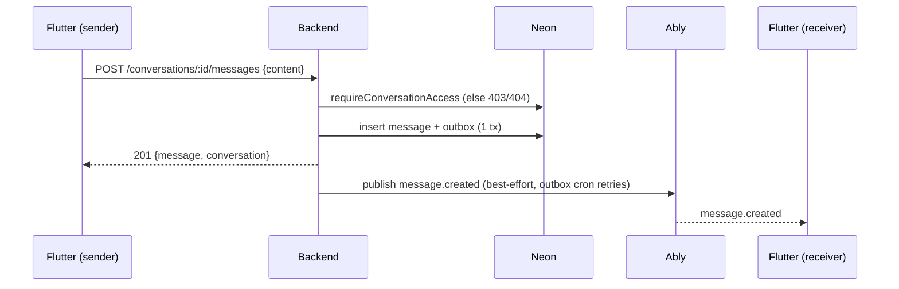
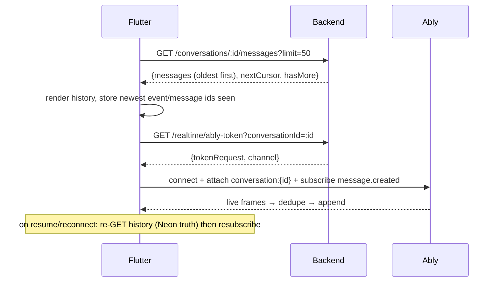
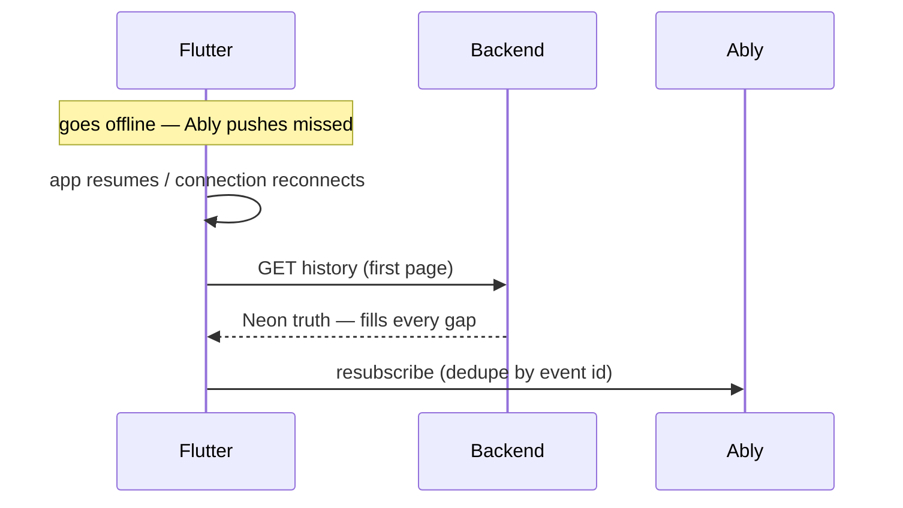

# Flutter Realtime Chat — Full Build Guide (REST + Ably)

Backend: Athletica Express + Prisma + Neon + Ably (`src/modules/messaging`, `src/modules/realtime`, `src/lib/ably.ts`).
Base URL examples use `https://api.athletica.app/api/v1` — replace with your dev/staging URL.
Ably package: `ably_flutter` (verify the latest API on pub.dev — the snippets below follow the pattern already used in this repo's docs).

> **Golden rule: Neon is the source of truth, Ably is transport only.**
> Send via REST `POST`, render the sender's bubble from the `201` response, deliver to the other device via Ably, and always catch up via REST history. Never treat an Ably push as persisted until history confirms it.

> **Never embed any Ably key in the app** — not the Root key, not a subscribe key.
> The app talks to Ably only through short-lived token requests from `GET /realtime/ably-token`. Keys stay server-side.

---

## 1. Architecture



ASCII fallback:

```
Flutter POST /messages  ──>  Backend: persist message + outbox row in ONE tx ──> 201
        │                                                                    │
        │ render bubble from 201 (sender)                    best-effort publish (≤2.5s)
        │                                                                    ▼
        │                                                        Ably channel conversation:{id}
        │                                                         event message.created
        │                                                                    │
        └──────── other device: Ably listener appends ────────────────────────┘
                   (offline? no push → GET history on next open catches up)
```

Message lifecycle on the server (`messaging.service.ts`):

1. Validate membership (`requireConversationAccess`) — coach must own `coach_id`, client must own `client_id`, assignment row must still exist in `coach_clients`.
2. `prisma.$transaction`: insert `messages` row + update `conversations.last_message_at` + insert `outbox_events` row (`event_type = message.created`).
3. Commit → `201`. Then opportunistic Ably publish (awaited, capped at 2.5s so serverless doesn't suspend mid-publish). Publish failure never fails the request — the outbox cron retries delivery.

---

## 2. Concepts and IDs

| ID | Where it comes from | Used for |
|----|---------------------|----------|
| `user.id` (JWT `sub`) | auth | Ably `clientId`, `sender_user_id` comparison for "is mine" |
| `coach_profiles.id` | coach profile | `conversation.coach_id` |
| `client_profiles.id` | client profile | `conversation.client_id`, deprecated `by-client` path only |
| `coach_clients.id` | `GET /coach/clients` → assignment `id`; also `conversation.coach_client_id` | **Canonical** first-message path `by-coach-client/:coachClientId`. The client MUST exist in `coach_clients` and belong to the calling coach, else `403` |
| `conversation.id` | list/get/send responses | history URL, token URL, Ably channel `conversation:{id}` |
| `message.id` | REST message object | list key, stable identity |
| Ably event `id` | live frame `id` (server-generated `eventId`) | **dedupe key** — retries/cron can redeliver the same event |

Channel: `conversation:{conversationId}`. Event name: `message.created`.
Flutter capability is `["subscribe","history"]` — the app can **never** publish. All sends go through REST.

One coach + one assigned client = exactly one conversation (DB: `conversations.coach_client_id @unique`, plus `@@unique([coach_id, client_id])`, race-safe lazy create).

---

## 3. Setup

```yaml
# pubspec.yaml
dependencies:
  dio: ^5.7.0
  ably_flutter: ^1.2.0   # verify latest on pub.dev
```

```dart
final dio = Dio(BaseOptions(
  baseUrl: 'https://api.athletica.app/api/v1',
  connectTimeout: const Duration(seconds: 15),
  receiveTimeout: const Duration(seconds: 30),
  headers: {'Accept': 'application/json', 'Content-Type': 'application/json'},
));

Future<void> attachAuth(String accessToken, String lang) async {
  dio.options.headers['Authorization'] = 'Bearer $accessToken';
  dio.options.headers['Accept-Language'] = lang; // 'en' | 'ar'
}
```

- Every call needs `Authorization: Bearer <accessToken>`. Missing/expired → `401` (refresh token, retry once). Wrong role / not a member → `403`.
- Send `Accept-Language: en|ar`. Errors are `{ error: <translated>, details?: [...] }` — **branch on HTTP status, never on translated text**.

---

## 4. Data models

### 4.1 `Conversation`

```json
{
  "id": "uuid",
  "coach_client_id": "uuid",
  "coach_id": "uuid",
  "client_id": "uuid",
  "created_at": "2026-09-23T12:00:00.000Z",
  "updated_at": "2026-09-23T12:00:00.000Z",
  "last_message_at": "2026-09-23T12:05:00.000Z"
}
```

```dart
class Conversation {
  final String id;
  final String coachClientId;
  final String coachId;
  final String clientId;
  final DateTime createdAt;
  final DateTime updatedAt;
  final DateTime? lastMessageAt;

  Conversation({required this.id, required this.coachClientId, required this.coachId,
    required this.clientId, required this.createdAt, required this.updatedAt, this.lastMessageAt});

  factory Conversation.fromJson(Map<String, dynamic> j) => Conversation(
    id: j['id'] as String,
    coachClientId: j['coach_client_id'] as String,
    coachId: j['coach_id'] as String,
    clientId: j['client_id'] as String,
    createdAt: DateTime.parse(j['created_at'] as String),
    updatedAt: DateTime.parse(j['updated_at'] as String),
    lastMessageAt: j['last_message_at'] == null ? null : DateTime.parse(j['last_message_at'] as String),
  );
}
```

### 4.2 `ChatMessage` (REST shape)

```json
{
  "id": "uuid",
  "conversation_id": "uuid",
  "sender_user_id": "uuid",
  "sender_role": "coach",
  "content": "Hello, how was your workout today?",
  "created_at": "2026-09-23T12:00:00.000Z",
  "updated_at": "2026-09-23T12:00:00.000Z"
}
```

```dart
class ChatMessage {
  final String id;
  final String conversationId;
  final String senderUserId;
  final String senderRole; // 'coach' | 'client'
  final String content;
  final DateTime createdAt;

  ChatMessage({required this.id, required this.conversationId, required this.senderUserId,
    required this.senderRole, required this.content, required this.createdAt});

  factory ChatMessage.fromJson(Map<String, dynamic> j) => ChatMessage(
    id: j['id'] as String,
    conversationId: j['conversation_id'] as String,
    senderUserId: j['sender_user_id'] as String,
    senderRole: j['sender_role'] as String,
    content: j['content'] as String,
    createdAt: DateTime.parse(j['created_at'] as String),
  );

  bool isMine(String myUserId) => senderUserId == myUserId;
}
```

### 4.3 History page

```json
{ "success": true, "data": { "messages": [], "nextCursor": "base64url-string | null", "hasMore": false } }
```

`messages` oldest first. `before` = opaque `nextCursor` of the previous page; omit for the first page.

### 4.4 Ably token response

`GET /realtime/ably-token?conversationId=<uuid>` →

```json
{
  "success": true,
  "data": {
    "tokenRequest": { "keyName": "...", "mac": "...", "nonce": "...", "timestamp": 0, "capability": "...", "clientId": "user-uuid" },
    "channel": "conversation:{conversationId}",
    "conversationId": "uuid"
  }
}
```

Pass `tokenRequest` straight into Ably — never parse or modify it.

### 4.5 Ably live frame (`message.created`, `m.data`)

```json
{
  "id": "event-uuid",
  "type": "message.created",
  "occurredAt": "2026-09-23T12:00:00.000Z",
  "payload": {
    "messageId": "uuid",
    "conversationId": "uuid",
    "senderUserId": "uuid",
    "senderRole": "coach",
    "content": "Hello",
    "createdAt": "2026-09-23T12:00:00.000Z"
  }
}
```

Map to `ChatMessage`: `id = payload.messageId`, `conversation_id = payload.conversationId`, `sender_user_id = payload.senderUserId`, `sender_role = payload.senderRole`, `content`, `created_at = payload.createdAt`. **Dedupe on the outer `id`** (event id), not `messageId`.

---

## 5. Flows

### Flow A — Coach first message (lazy-create conversation)



Dart:

```dart
Future<(Conversation, ChatMessage)> sendFirstMessage(String coachClientId, String text) async {
  final res = await dio.post(
    '/messaging/conversations/by-coach-client/$coachClientId/messages',
    data: {'content': text},
  );
  final data = res.data['data'];
  return (
    Conversation.fromJson(data['conversation']),
    ChatMessage.fromJson(data['message']),
  );
}
```

- `:coachClientId` = `coach_clients.id` from the coach's client list (or `conversation.coach_client_id`). Unknown/unowned row → `403` (opaque on purpose).
- Deprecated alias `POST .../by-client/:clientId/messages` (`client_profiles.id`) still works — prefer the canonical path.

### Flow B — Send inside an existing conversation (coach + client)



```dart
Future<ChatMessage> sendToConversation(String conversationId, String text) async {
  final res = await dio.post(
    '/messaging/conversations/$conversationId/messages',
    data: {'content': text},
  );
  return ChatMessage.fromJson(res.data['data']['message']);
}
```

Content rules (server-trimmed): empty → `400 { details: ["message_content_required"] }`, over 2000 chars → `400 { details: ["message_content_too_long"] }`. Validate client-side first, but always handle `400`.

### Flow C — Open a chat (history + subscribe + catch-up)



```dart
Future<HistoryPage> getHistory(String conversationId, {String? before, int limit = 50}) async {
  final res = await dio.get(
    '/messaging/conversations/$conversationId/messages',
    queryParameters: {'limit': limit, if (before != null) 'before': before},
  );
  final data = res.data['data'];
  return HistoryPage(
    messages: (data['messages'] as List).map((e) => ChatMessage.fromJson(e)).toList(),
    nextCursor: data['nextCursor'],
    hasMore: data['hasMore'] as bool,
  );
}
```

Pagination: while `hasMore`, pass `before: nextCursor` for the next (older) page. Order inside a page is newest-first (`created_at desc, id desc`); reverse for display oldest-at-top.

### Flow D — Realtime subscribe (Ably, subscribe-only)

```dart
import 'package:ably_flutter/ably_flutter.dart' as ably;

late ably.Realtime realtime;
final Set<String> seenEventIds = {}; // dedupe across reconnects + cron redelivery

Future<void> connectChat(String conversationId) async {
  final options = ably.ClientOptions()
    ..authCallback = (params) async {
      final res = await dio.get(
        '/realtime/ably-token',
        queryParameters: {'conversationId': conversationId},
      );
      return ably.TokenRequest.fromMap(
        Map<String, dynamic>.from(res.data['data']['tokenRequest']),
      );
    };

  realtime = ably.Realtime(options: options);
  await realtime.connection.on(ably.ConnectionEvent.connected).first;

  final channel = realtime.channels.get('conversation:$conversationId');
  await channel.attach();
  channel.subscribe(name: 'message.created').listen((msg) {
    final data = Map<String, dynamic>.from(msg.data as Map);
    final eventId = data['id'] as String;
    if (!seenEventIds.add(eventId)) return; // duplicate delivery → ignore
    final p = Map<String, dynamic>.from(data['payload'] as Map);
    appendMessage(ChatMessage(
      id: p['messageId'] as String,
      conversationId: p['conversationId'] as String,
      senderUserId: p['senderUserId'] as String,
      senderRole: p['senderRole'] as String,
      content: p['content'] as String,
      createdAt: DateTime.parse(p['createdAt'] as String),
    ));
  });
}
```

Notes:

- `authCallback` runs on connect and on token expiry — it re-calls your backend, so token refresh is automatic. If it returns `401`, refresh your app JWT first, then retry.
- Token request failures: `400 invalid_uuid` (bad id), `403` (not a member), `404` (unknown conversation), `500 ably_not_configured` (server missing `ABLY_API_KEY` — show "realtime unavailable, pull-to-refresh").
- Always `await channel.attach()` before trusting delivery; on `suspended`/`failed` connection states, fall back to history polling and re-attach on `connected`.
- Keep `seenEventIds` bounded (e.g. last 500) to avoid unbounded growth.

### Flow E — Offline / reconnect / redelivery



Rules:

1. History after every resume — a missed Ably push is normal (offline device, 2.5s publish cap, cron delay).
2. Sender never waits for its own echo — the `201` response is the confirmation.
3. Receiver dedupes by event `id`; outbox retries can legitimately redeliver the same event.
4. Ordering: sort display list by `(createdAt, id)`; server pages are newest-first with the same tiebreak.

---

## 6. REST reference

| Method & path | Who | Success | Notes |
|---|---|---|---|
| `GET /messaging/conversations?limit=50` | coach, client | `200 { conversations }` | Coach → all theirs (recent first, never-messaged last); client → their one. `limit` 1..50, default 50 |
| `GET /messaging/conversations/:conversationId` | member | `200 { conversation }` | `403` not a member, `404` unknown, `400 invalid_uuid` |
| `POST /messaging/conversations/by-coach-client/:coachClientId/messages` | coach only **[CANONICAL]** | `201 { message, conversation }` | `:coachClientId` = `coach_clients.id`; must belong to caller, else `403` |
| `POST /messaging/conversations/by-client/:clientId/messages` | coach only [DEPRECATED alias] | `201 { message, conversation }` | `:clientId` = `client_profiles.id`; prefer canonical |
| `POST /messaging/conversations/:conversationId/messages` | member | `201 { message, conversation }` | membership re-checked after lazy create |
| `GET /messaging/conversations/:conversationId/messages?limit=&before=` | member | `200 { messages, nextCursor, hasMore }` | oldest first; `before` = previous `nextCursor` |
| `GET /realtime/ably-token?conversationId=` | member | `200 { tokenRequest, channel, conversationId }` | short-lived, subscribe+history only; `clientId` = your `user.id` |

All success bodies: `{ "success": true, "data": {...} }`. All errors: `{ "error": "<translated>", "details"?: [...] }`.

---

## 7. Suggested Flutter structure

```dart
class ChatController extends ChangeNotifier {
  final String conversationId;
  final String myUserId;
  final List<ChatMessage> messages = []; // oldest-first for ListView
  final Set<String> _seenEventIds = {};
  String? _cursor;
  bool _hasMore = true;

  Future<void> open() async {
    await loadFirstPage();   // REST history (truth)
    await connectChat(conversationId); // Ably live
  }

  Future<void> loadFirstPage() async {
    final page = await getHistory(conversationId);
    messages
      ..clear()
      ..addAll(page.messages.reversed); // newest-first → oldest-first
    _cursor = page.nextCursor;
    _hasMore = page.hasMore;
    notifyListeners();
  }

  Future<void> loadOlder() async {
    if (!_hasMore) return;
    final page = await getHistory(conversationId, before: _cursor);
    messages.insertAll(0, page.messages.reversed);
    _cursor = page.nextCursor;
    _hasMore = page.hasMore;
    notifyListeners();
  }

  Future<void> send(String text) async {
    final msg = await sendToConversation(conversationId, text); // 201
    if (_seenEventIds.add(msg.id)) {
      messages.add(msg);
      notifyListeners();
    }
  }

  void onLiveFrame(Map<String, dynamic> data) {
    if (!_seenEventIds.add(data['id'] as String)) return; // dupe
    // ... map payload → ChatMessage, add, notifyListeners
  }

  Future<void> onResume() async {
    await loadFirstPage(); // catch up anything missed offline
    // resubscribe handled by Ably auto-reconnect + authCallback
  }
}
```

Dispose order on chat close: cancel subscription → detach channel → close realtime client → clear controller state.

---

## 8. Error table (branch on status)

| Status | `details` / meaning | App action |
|---|---|---|
| 400 | `invalid_uuid`, `message_content_required`, `message_content_too_long`, `invalid_limit`, `invalid_cursor` | fix request / show inline validation |
| 401 | missing/expired JWT (REST or token endpoint) | refresh app token, retry once |
| 403 | wrong role, not a member, unknown/unowned `coach_client` row (opaque on purpose) | show "chat unavailable", re-fetch client/conversation list |
| 404 | conversation not found | drop cached id, re-list conversations |
| 500 | `ably_not_configured` | realtime unavailable — keep REST send/history working, show banner |

---

## 9. Build & test checklist

- [ ] Coach starts chat with `coach_clients.id` → `201`, conversation appears in both users' lists.
- [ ] Wrong coach's `coach_client_id` → `403`; random UUID → `403` (not `404`).
- [ ] Client role on `by-coach-client` → `403` (route-level).
- [ ] Send empty text → `400 message_content_required`; 2001 chars → `400 message_content_too_long`.
- [ ] Receiver online gets the bubble via Ably (dedupe: send once, render once even on redelivery).
- [ ] Receiver offline → sees the message after next history fetch (no Ably needed).
- [ ] History pagination: page 1 + `before=nextCursor` returns older messages, `hasMore=false` at the end.
- [ ] Kill + resume app → history catch-up, no gaps, no duplicates.
- [ ] Expired app JWT → `401` → refresh → retry succeeds.
- [ ] `ABLY_API_KEY` missing on server → token endpoint `500`, REST chat still fully works.
